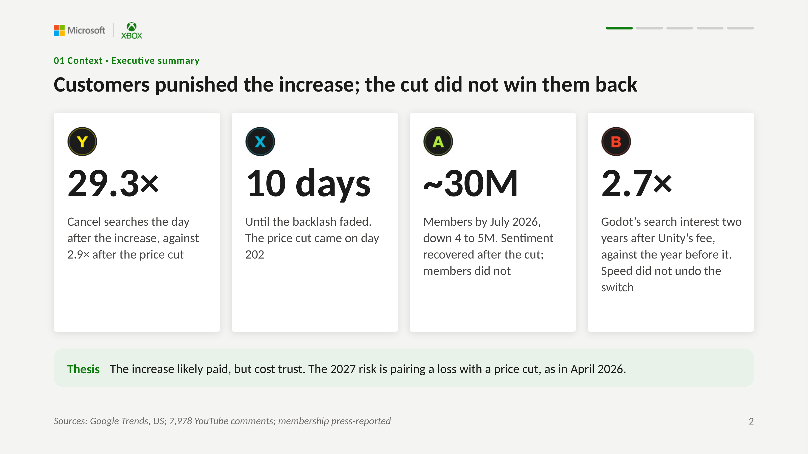
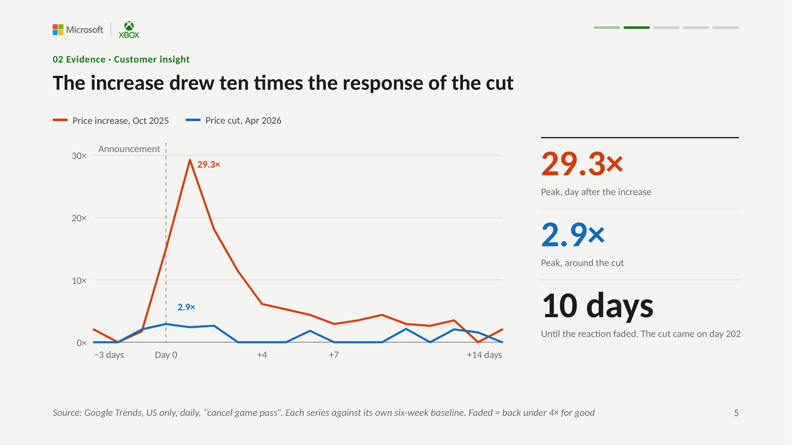
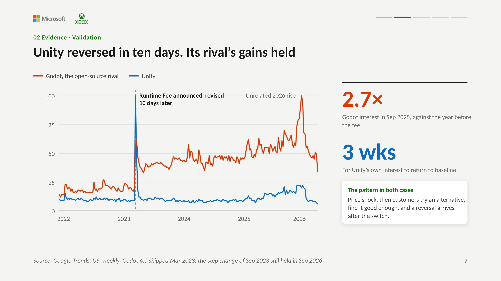
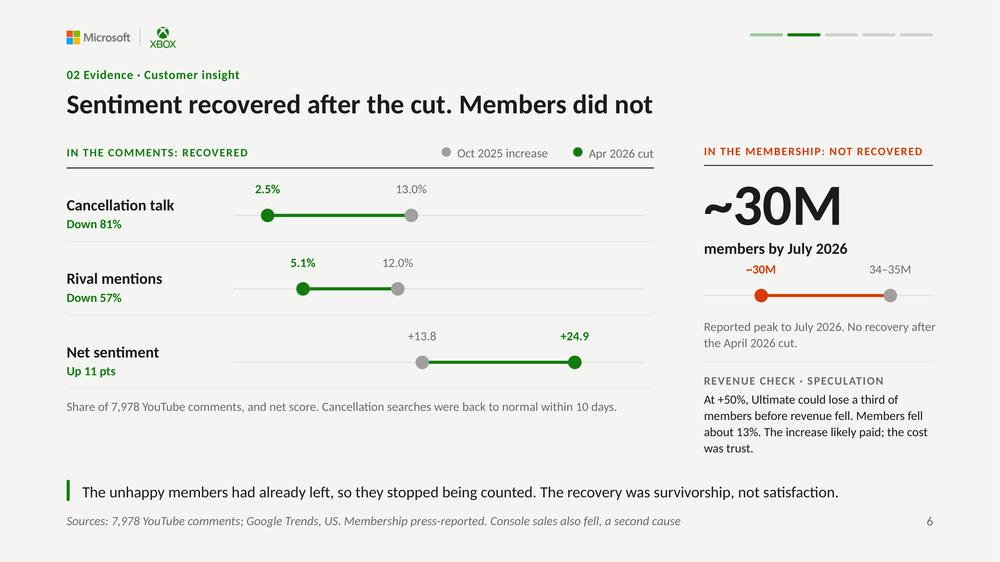
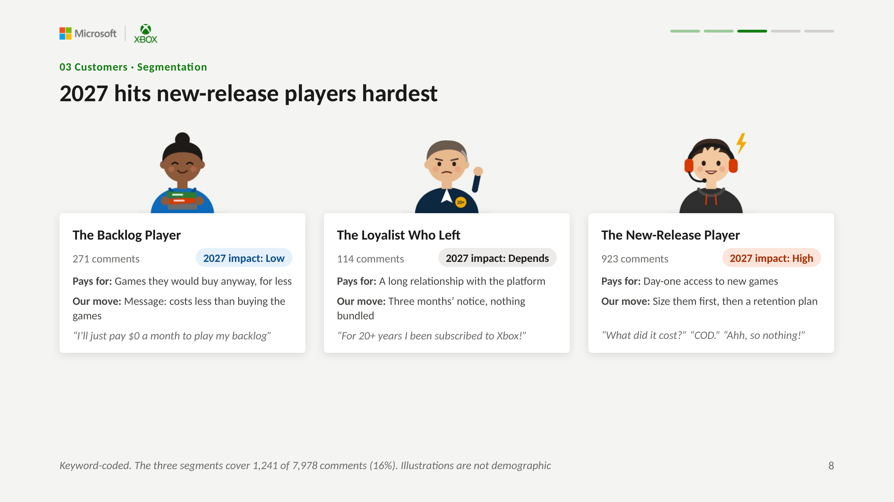
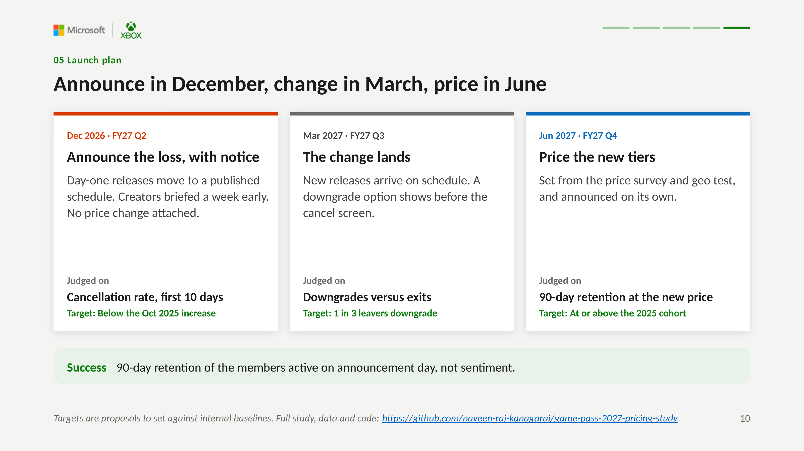

# Game Pass 2027: What the 2026 Price Reversal Can Teach the Next Change

**The October 2025 increase likely paid, but it cost trust. The 2027 risk is pairing a loss with a price cut, as in April 2026.**

An independent pricing and product marketing study of Xbox Game Pass. It measures the customer response to the October 2025 price increase and the April 2026 price cut, tests the pattern against a second case (Unity, 2023), and ends with a go-to-market plan for the reported 2027 restructure.

**Read the deck:** [10-slide executive summary](deck/GamePass2027_Executive_Summary.pdf) · [18-slide full study](deck/GamePass2027_Full_Study.pdf)

---

## Four findings

| | Finding | Evidence |
|---|---|---|
| **29.3×** | The increase drew ten times the reaction of the cut | Daily US searches for "cancel game pass" peaked at 29.3× their normal level after the increase, against 2.9× after the cut |
| **10 days** | The backlash was short | Searches fell back under 4× normal within 10 days. The price cut came 202 days after the increase |
| **~30M** | Sentiment recovered; members did not | Cancellation talk fell 81% and net sentiment rose 11 points after the cut, yet membership stayed near 30M, down from a reported 34 to 35M |
| **2.7×** | Reversing fast did not undo the switch | Unity reversed its 2023 fee within 10 days. Two years later, interest in its rival Godot was still 2.7× the level of the year before |



| The increase against the cut | The Unity case |
|---|---|
|  |  |

## Why sentiment misled: the survivorship trap

Any metric measured over people who can leave improves when the unhappy ones leave. After the cut, sentiment in the comments recovered, but the people who had cancelled were no longer in the data.



**Revenue check (speculation).** At +50%, Ultimate could lose a third of its members before revenue fell. Members fell about 13%. The increase likely paid in revenue; what it cost was trust, which the 2027 change cannot afford to spend again.

## Recommendation

Four decisions for the 2027 change, before November 2026 (FY27 Q2). The study takes the move of day-one releases as decided and covers how to launch it.

| | Decision | Evidence |
|---|---|---|
| Decide | Announce the loss on its own, with no price change attached | Call of Duty went from 2.1% to 17.1% of comments when the April cut shipped with a loss |
| Decide | Give members three months' notice | When July 2024 gave two months' notice, weekly cancel searches rose 1.1×, against 8.4× in October 2025 |
| Approve | Run four tests before setting a price | Public data can place only 16% of comments in a segment |
| Commit | Judge the launch on 90-day cohort retention, not sentiment | Members held flat after the cut while sentiment rose 11 points |

| Segmentation | Launch plan |
|---|---|
|  |  |

The full study adds the 2027 risk assessment, positioning, messaging framework, channel plan, workstream timeline, a drafted announcement and a measurement scorecard with proposed targets.

---

## Data

| Source | What | File |
|---|---|---|
| Google Trends, US | Weekly "cancel game pass" and "xbox game pass", Jan 2024 to Sep 2026; daily series around each event | `data/google_trends/` |
| Google Trends, US | Weekly "godot" and "unity engine", Jan 2022 to Sep 2026 | `data/unity_godot/` |
| YouTube Data API | 7,978 comments on 34 videos covering the two events | `data/comments/comment_ids.csv` (IDs only) |
| Microsoft earnings | Xbox hardware revenue, FY26 Q2 and Q3 | Cited in the deck |

Comment text is not redistributed, in line with the YouTube API Terms of Service. The IDs let you re-fetch the exact sample.

## Method

- **Event reaction.** Each daily series is divided by its own baseline, the mean of days −45 to −3 before the announcement, so the two events compare directly.
- **Robustness check.** Weekly cancel searches divided by general "xbox game pass" interest, so outside shocks cancel out. It points the same way: 2.1× in the week of the increase, 0.6× in the week of the cut.
- **Notice precedent.** In July 2024 Ultimate rose 18% and existing members paid more two months later. Weekly cancel searches rose 1.1× against the eight weeks before, compared with 8.4× for the October 2025 increase. The increases differ in size, so this supports advance notice; it does not prove it.
- **Comments.** Keyword rules in [`src/code_themes.py`](src/code_themes.py) code themes and segments, and a comment can carry several themes. Sentiment uses VADER. Theme counts are the robust measure, because VADER misreads sarcasm.
- **Rejected model.** A standard interrupted time series was fitted first and rejected: it flagged significant effects in the PlayStation Plus control, and both outside controls turned out to be contaminated by events of their own. The within-series comparison above replaced it.

## Limits

- Timing shows association, not proof of cause; causal claims need member-level data.
- Console sales fell over the same period (Xbox hardware revenue down 32% and 33% in the two quarters after the increase), a second cause of member loss.
- Search data is US and English only; other markets are untested.
- Segments come from public comments, not member data. They show who is talking, not how many members each group holds.
- Membership figures and the 2027 plan are press-reported, not confirmed by Microsoft.
- Two cases are a pattern, not a law. Unity sells developer tooling, with different switching costs.
- Targets in the deck are proposals, to be set against internal baselines.

## Reproduce

Download this repository (**Code → Download ZIP**), unzip it, and run from the folder:

```bash
pip install -r requirements.txt

# 1. Search figures (29.3×, 2.9×, 10 days, 202 days, 2.7×, notice precedent 1.1× vs 8.4×)
python src/analyze_trends.py

# 2. Comment figures: re-fetch the exact sample, then code it
export YOUTUBE_API_KEY=your_key
python src/collect_youtube.py --from-ids
python src/code_themes.py
```

Results are written to `outputs/`. The committed `outputs/` files are the ones behind the decks. Comments deleted since collection cannot be re-fetched, so re-run shares may move by a few tenths of a percent.

## Repository

```
deck/      Executive summary (10 slides) and full study (18 slides), PDF
images/    Slide images used in this README
data/      Google Trends exports and YouTube comment IDs
src/       Collection, trend analysis and theme coding
outputs/   The figures behind the decks
```

## About

Naveen Raj Kanagaraj, MS Marketing Analysis, DePaul University, Chicago.

*Independent analysis. Not affiliated with or endorsed by Microsoft, Xbox or Unity. Xbox, Game Pass and Microsoft are trademarks of Microsoft Corporation. Console images in the decks: Microsoft.*
